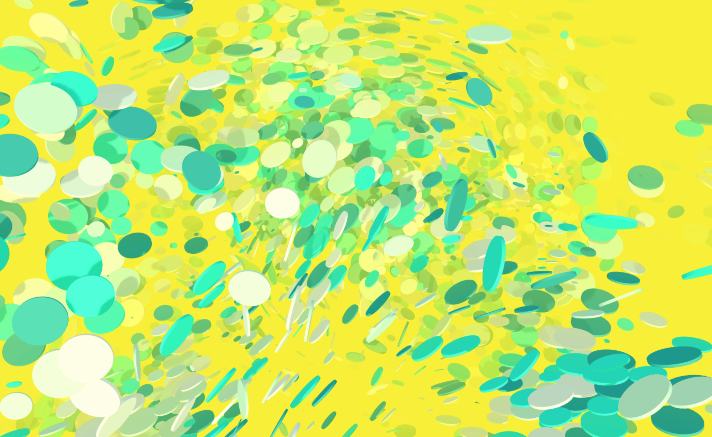
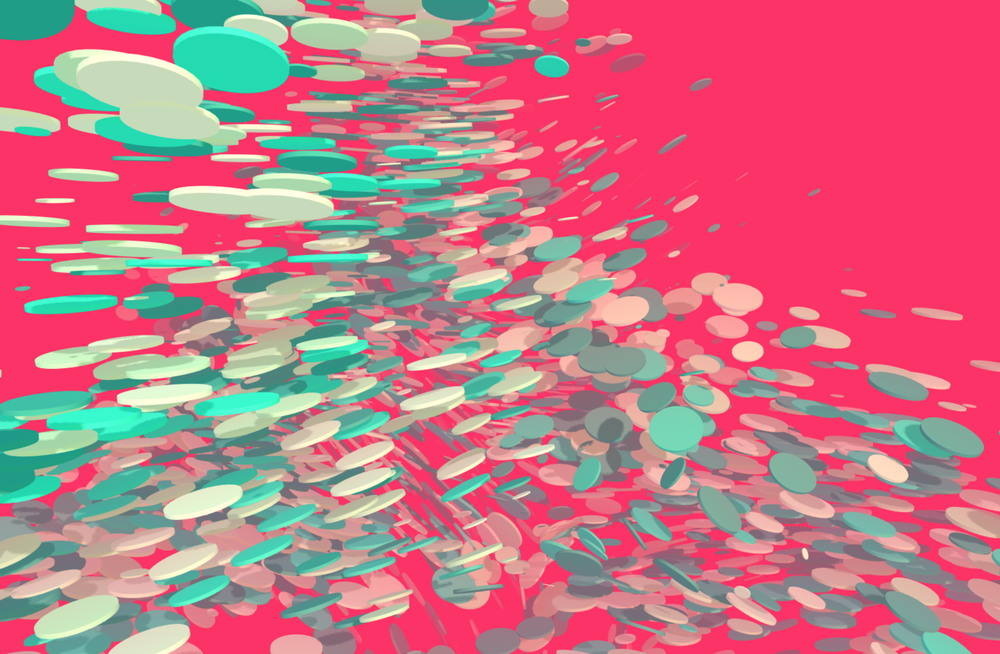

# Shadowmap & Fog Test
  
* [demo](https://mnmxmx.github.io/shadowmap-fog-demo/dst/)  
* inspired by [spite - polygon-shredder](https://github.com/spite/polygon-shredder)  
  
[](./screenshot1.png)  
[](./screenshot2.png)  
[](./screenshot3.png)  
  
## Resources  
* [OpenGL Shadow Mapping](https://learnopengl.com/Advanced-Lighting/Shadows/Shadow-Mapping)  
* [WebGL Shadow Mapping(in Japanese)](https://wgld.org/d/webgl/w051.html)  
* [WebGL Fog(in Japanese)](https://wgld.org/d/webgl/w060.html)  
  
## Usage  
* Clone repository  
* Install Node.js  
* Run following commands  
```
  npm install  
  npm start  
```

